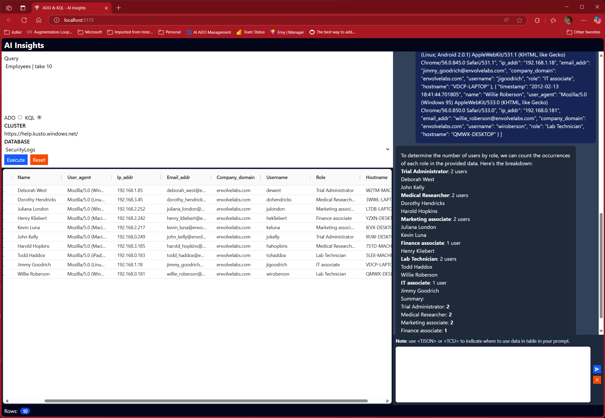

# ADO/KQL Query Chatbot

A tools that allows a user to execute ADO and KQL queries and use the results as part of a chat conversation.

## Python Server and React Frontend

Server ([main.py](src/adokqlbot/main.py)):
- Python 3.11+
- Poetry
- FastAPI
- Uvicorn
- OpenAI SDK
- Python-DotEnv

Frontend ([App.tsx](frontend/src/App.tsx)):
- Node or bun
- React
- Vite
- TailwindCSS
- Axios
- React Markdown
- Ag Data Grid
- React Icons

## App development and testing

## Clone the repo

- `git clone https://github.com/msalemor/adokql-query-bot.git`
- `cd adokql-query-bot`

### Create the `.env` file or create the following environment variables:

```bash
AZURE_DEVOPS_PAT=<PAT_TOKEN>
AZURE_OPENAI_ENDPOINT=https://<NAME>.openai.azure.com/
AZURE_OPENAI_API_KEY=<KEY>
AZURE_OPENAI_VERSION=2024-02-15-preview
AZURE_OPENAI_MODEL=gpt-4o # or model name
ADO_ORGANIZATION=<PROJECT_NAME>
```

### Poetry project setup (environment and package installation)

```bash
# Install dependencies using Poetry
poetry install
```

### Start the server (VSCode terminal)

```bash
# Start the server
poetry run python -m src.adokqlbot.main`
```

### Run the frontend (VSCODE another terminal)

```bash
- cd frontend
- npm install # do this once, I use bun, so I do bun install
- npm run dev # or bun run dev
```

## Screenshots

### KQL Sample - Query results and conversation


